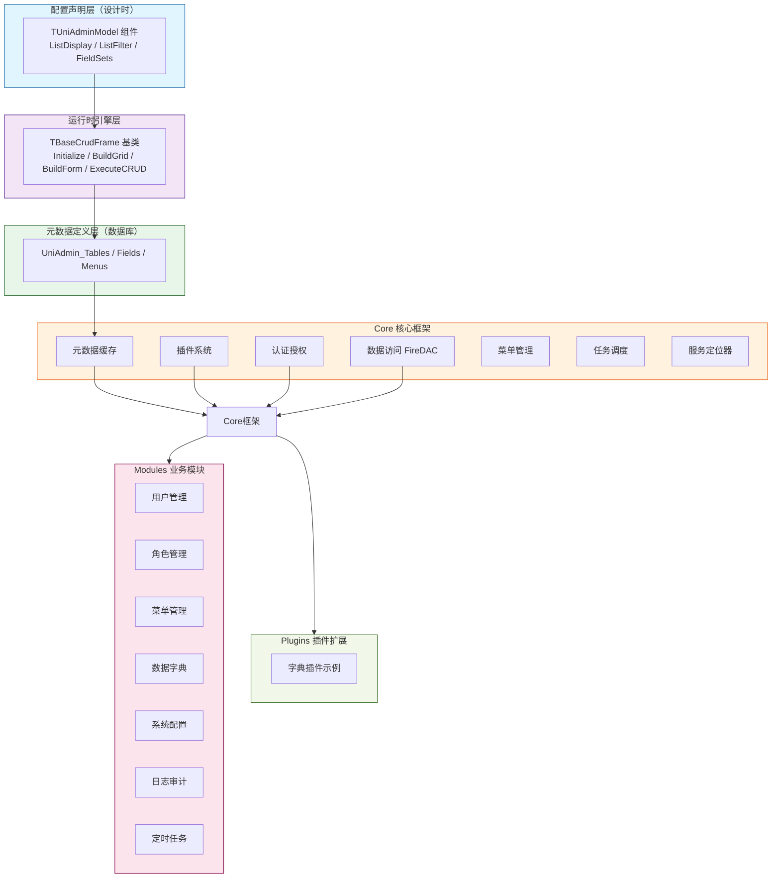
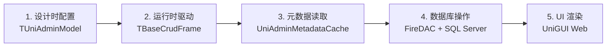

# CLAUDE.md

> 本文件为 AI 编码助手提供 UniAdmin 项目的完整上下文导航。
> 最后更新：2026-06-24

---

## 项目概述

**UniAdmin** 是基于 Delphi 12 Athens + UniGUI 的零代码后台管理框架，借鉴 Django Admin 设计理念。

- **插件化核心** — 动态加载、注册、依赖解析的业务模块扩展
- **零代码 CRUD** — 通过 TUniAdminModel 组件声明式配置，运行时自动生成列表和表单
- **元数据驱动** — 自动发现数据库 Schema，配置驱动 UI 生成
- **RBAC 权限** — 用户-角色-权限三级模型，支持数据范围控制
- **任务调度** — Cron 表达式驱动的定时任务
- **日志审计** — 登录日志、操作日志、数据变更日志，支持多格式导出

| 组件 | 技术 |
|------|------|
| 语言 | Delphi 12 Athens (Object Pascal) |
| Web 框架 | UniGUI 1.6+ |
| 数据访问 | FireDAC |
| 数据库 | SQL Server |
| 测试框架 | DUnitX |
| 构建 | MSBuild (VS 2022 BuildTools) |
| 编辑器 | VS Code + DelphiLSP |

---

## 架构总览



### 三层架构数据流



---

## 模块索引

| 模块 | 路径 | 说明 | 文档 |
|------|------|------|------|
| **Core 核心框架** | `src/Core/` | 插件、认证、数据访问、元数据、UI 框架 | [CLAUDE.md](src/Core/CLAUDE.md) |
| **Modules 业务模块** | `src/Modules/` | 用户/角色/菜单/字典/配置/日志/任务 | [CLAUDE.md](src/Modules/CLAUDE.md) |
| **Plugins 插件扩展** | `src/Plugins/` | 插件开发示例和扩展机制 | [CLAUDE.md](src/Plugins/CLAUDE.md) |
| **Frames 管理框架** | `src/Frames/` | 配置管理器、插件管理器 Frame | [CLAUDE.md](src/Frames/CLAUDE.md) |
| **Database 数据库** | `Database/` | Schema 定义 + Seed 初始数据 | [CLAUDE.md](Database/CLAUDE.md) |
| **Tests 单元测试** | `tests/` | DUnitX 测试框架 | [CLAUDE.md](tests/CLAUDE.md) |
| **Tools 开发工具** | `tools/` | 代码生成、性能分析、日志查看等 | [CLAUDE.md](tools/CLAUDE.md) |
| **Config 配置** | `config/` | 应用运行时配置 | [CLAUDE.md](config/CLAUDE.md) |
| **Docs 文档** | `docs/` | 开发指南、架构设计、API 文档 | — |

---

## 构建与运行

```bash
# 编译项目（VS Code 任务: Ctrl+Shift+B → "build"）
.vscode/CompileOmniPascalServerProject.bat build

# 编译并运行（VS Code 任务: "test"）
.vscode/CompileOmniPascalServerProject.bat test

# 清理构建产物
clean.bat

# 运行单元测试
cd tests && UniAdminTests.exe
```

| 项目 | 说明 |
|------|------|
| 主项目入口 | `src/UniAdmin.dpr` |
| 测试项目入口 | `tests/UniAdminTests.dpr` |
| 输出目录 | `bin/` |
| 运行端口 | `8077`（可在 `config/app.json` 修改） |

---

## 核心开发模式

### CRUD 模块开发

```pascal
// 继承 TBaseCrudFrame
TMyListFrame = class(TBaseCrudFrame)
protected
  procedure DoInitialize; override;  // 初始化网格列
  procedure DoRefresh; override;     // 加载数据
end;

// 配置 ModelAdmin
ModelAdmin.TableName := 'MyTable';
ModelAdmin.PrimaryKey := 'ID';
ModelAdmin.ListDisplay.Add('FieldName');
```

### 插件开发

```pascal
type
  TMyPlugin = class(TPlugin, IPlugin)
  protected
    procedure DoInitialize; override;
    procedure DoActivate; override;
  end;

// 注册插件
TUniAdminModuleRegistry.GetInstance.RegisterPluginClass(TMyPlugin, 'my-plugin', LPluginInfo);
```

### 服务层模式

```pascal
// 接口定义 (.Intf.pas)
IMyService = interface(IInterface)
  ['{GUID}']
  function GetData(const ID: Integer): TData;
end;

// 注册到服务定位器
TUniAdminServices.RegisterService<IMyService>(TMyService);
```

---

## 关键开发规范

### Delphi 窗体文件结构

每个 Delphi 窗体**必须**包含两个同名文件：
- `.pas` — 窗体代码（逻辑和事件处理器）
- `.dfm` — 窗体设计（可视化布局）
- 两个文件**必须**在同一目录

**只有 TForm/TFrame/TDataModule 及其子类才能拥有独立的 .dfm 文件。**

### DFM 文件中文字符转义

```dfm
// 纯中文：无引号
Caption = #29992#25143#30331#24405

// 中文+标点：标点用单引号
Caption = #20851#38190#35789':'

// 纯英文：单引号
Caption = 'OK'

// ❌ 错误：纯中文不需要外层引号
Caption = '#29992#25143'
```

### 常见编译错误预防

| 错误 | 原因 | 解决方案 |
|------|------|----------|
| E2003 Undeclared identifier | 缺少 uses 引用 | 搜索类型定义位置，添加 uses |
| E2003 'Dispose' | 类实例用 Dispose | 类实例用 `.Free`，Dispose 仅用于 New 分配的指针 |
| E2003 Undeclared 'UniSession'（MainModule 内） | `UniApplication` 标识符在 TUniGUIMainModule 子类中与 Self.UniApplication 歧义 | 用带单元前缀的 `uniGUIApplication.UniApplication.UniSession.X`（见 LRN-20260626-001） |
| E2035 Not enough parameters | 参数数量不匹配 | 检查方法声明，确保参数匹配 |
| Record 字段错误 | 假设字段名 | 使用前查看实际 record 定义 |
| E2003 Undeclared 'TUniTreeNode' | TUniTreeNode 定义在 `uniGUIAbstractClasses`（**非** uniTreeView，后者用 TWebTreeNode） | uses 加 `uniGUIAbstractClasses`；详见 LRN-20260626-001 |
| EReadError 'Property TabOrder does not exist'（运行时） | TUniLabel 继承 `TUniControl`（非 TWinControl）无 TabOrder，linter 易批量误加 | DFM 不给 TUniLabel（及 TUniControl 派生控件）写 TabOrder；详见 LRN-20260626-002 |
| EInvalidPointer 'Invalid pointer operation'（退出时） | `FQuery.Connection` 裸引用 MainModule.Connection，销毁顺序导致悬挂 | Frame destructor 先 `FQuery.Connection := nil` 再 `FQuery.Free`；详见 LRN-20260626-003 |

### 泛型集合操作 (TList\<T\>)

```pascal
// ❌ 错误：索引访问返回只读副本
FTasks[I].Field := Value;

// ✓ 正确：先取出，修改，再赋回
LItem := FTasks[I];
LItem.Field := Value;
FTasks[I] := LItem;
```

### 命名约定

```pascal
// 单元名：PascalCase
unit MainForm;

// 类名：T 前缀 + PascalCase
TUserListFrame = class(TUniFrame)

// 组件名：类型前缀
btnSave: TUniButton;      // btn
edtUsername: TUniEdit;    // edt
grdUsers: TUniDBGrid;     // grd
qryUsers: TFDQuery;       // qry (FireDAC)

// 私有字段：F 前缀
FCurrentUser: TUser;

// 常量：ALL_CAPS
MAX_RETRY_COUNT = 3;
```

### 单元引用速查

| 单元 | 用途 |
|------|------|
| `System.Math` | `IfThen()` 整数版本 |
| `System.StrUtils` | `IfThen()` 字符串版本 |
| `System.DateUtils` | `DateOf`, `MilliSecondsBetween`, `EncodeTime` |
| `System.UITypes` | `mrOK`, `mrCancel`, `caFree` |
| `System.Generics.Collections` | `TPair<>`, `TDictionary<>` |
| `FireDAC.Comp.Client` | `TFDQuery`, `TFDConnection` |
| `FireDAC.Stan.Param` | 消除 TFDParam 内联函数警告 |

### UniGUI 特定规范

- **事件签名**：必须包含 `Sender: TObject` 参数
- **定时器**：使用 `TUniTimer` 而非 VCL 的 `TTimer`
- **窗体释放**：不需要 `Action := caFree`，框架自动管理
- **消息提示**：使用 `ShowMessage()`，非 `UniGUIApplication.ShowMessage()`
- **错误处理**：使用 `try-finally` 管理资源，`try-except` 处理预期错误
- **SQL 查询**：始终使用参数化查询防止 SQL 注入

---

## 数据库 Schema

| 表名 | 说明 |
|------|------|
| `UniAdmin_Modules` | 业务插件注册表 |
| `UniAdmin_Configs` | 系统/模块配置 |
| `UniAdmin_ModuleDependencies` | 模块依赖关系 |
| `UniAdmin_Users` | 用户表 |
| `UniAdmin_Roles` | 角色表 |
| `UniAdmin_Permissions` | 权限表 |
| `UniAdmin_UserRoles` | 用户角色关联 |
| `UniAdmin_RolePermissions` | 角色权限关联 |
| `UniAdmin_Menus` | 菜单表 |
| `UniAdmin_UserMenus` | 用户菜单关联 |
| `UniAdmin_DictTypes` | 字典类型 |
| `UniAdmin_DictItems` | 字典项 |
| `UniAdmin_LoginLogs` | 登录日志 |
| `UniAdmin_OperationLogs` | 操作日志 |
| `UniAdmin_DataChangeLogs` | 数据变更日志 |
| `UniAdmin_ScheduledTasks` | 定时任务 |
| `UniAdmin_TaskExecutionLogs` | 任务执行日志 |

---

## 目录结构

```
unigui-admin/
├── src/
│   ├── Core/              核心框架（Auth, Config, Context, Data, Main, Menu, Metadata, Permission, Plugin, Scheduler, Services, Session, UI）
│   ├── Modules/           业务模块（User, Role, Menu, Dictionary, Config, Log, Scheduler, Shared）
│   ├── Plugins/           插件扩展（Dictionary 示例）
│   ├── Frames/            管理框架（ConfigManager, PluginManager）
│   └── UniAdmin.dpr       主程序入口
├── tests/                 DUnitX 单元测试
├── tools/                 开发工具（代码生成器、性能分析器等）
├── Database/
│   ├── Schema/            建表脚本（01-Plugin, 02-Core, 03-System）
│   └── Seed/              初始数据脚本
├── config/                运行时配置（app.json）
├── docs/                  项目文档（开发指南、架构设计、API 等）
├── .vscode/               VS Code 任务和设置
├── bin/                   编译输出
├── ProjectConfig.json     项目配置 Schema
└── AGENTS.md              构建系统和编码规范
```

---

## 参考资源

- [TBaseCrudFrame 架构指南](docs/TBaseCrudFrame-Architecture-Guide.md)
- [Delphi DFM/PAS 文件规范](docs/Delphi-DFM-PAS-File-Standards.md)
- [UniGUI 官方文档](http://www.unigui.com/doc/)
- **UniGUI 案例库**: `D:\BaiduNetdiskDownload\vcl\UniGUI_1600\uniGUI\Demos`
- **UniFalcon 扩展控件**: `D:\BaiduNetdiskDownload\vcl\UniFalcon\Demos`
