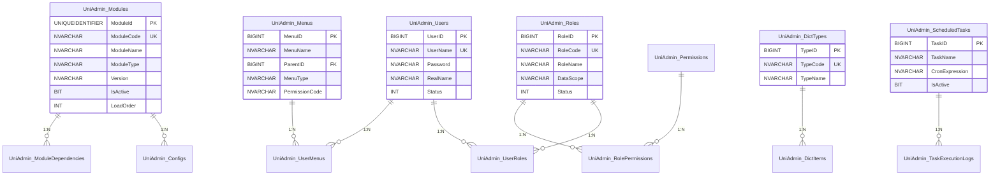
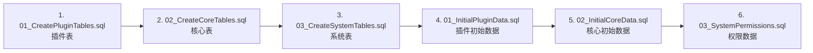

[根目录](../CLAUDE.md) > **Database**

# Database 模块 — 数据库 Schema 与初始数据

> **职责**: UniAdmin 系统的数据库表结构定义和初始数据
> **数据库**: SQL Server (MSSQL)
> **状态**: ✅ 完成

---

## 目录结构

```
Database/
├── Schema/
│   ├── 01_CreatePluginTables.sql    # 插件管理表（Modules, Configs, ModuleDependencies）
│   ├── 02_CreateCoreTables.sql      # 核心表（Users, Roles, Permissions, Menus）
│   └── 03_CreateSystemTables.sql    # 系统表（DictTypes, Configs, Logs, Tasks）
└── Seed/
    ├── 01_InitialPluginData.sql     # 初始插件注册数据
    ├── 02_InitialCoreData.sql       # 初始用户/角色/菜单数据
    └── 03_SystemPermissions.sql     # 系统权限定义
```

---

## 数据库表总览



---

## 执行顺序



**先执行 Schema（建表），再执行 Seed（数据）。**

---

## 关键设计

- **主键策略**: 插件表使用 `UNIQUEIDENTIFIER`，业务表使用 `BIGINT IDENTITY`
- **索引**: 所有外键和常用查询字段均建有索引
- **审计字段**: 每张表包含 `CreatedAt`、`UpdatedAt` 字段
- **触发器**: `UniAdmin_Modules` 和 `UniAdmin_Configs` 有自动更新 `UpdatedAt` 的触发器
- **视图**: `VW_UniAdmin_ModuleDependencies` 和 `VW_UniAdmin_ModuleConfigs`

---

*模块版本: 1.0*
*最后更新: 2026-06-24*
