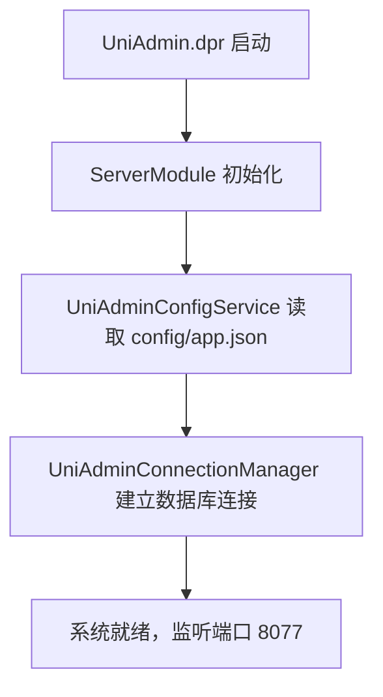

[根目录](../CLAUDE.md) > **config**

# Config 模块 — 运行时配置

> **职责**: UniAdmin 应用的运行时配置文件
> **状态**: ✅ 完成

---

## 目录结构

```
config/
└── app.json    # 应用运行时配置
```

---

## app.json 配置项

| 配置项 | 默认值 | 说明 |
|--------|--------|------|
| `application.name` | `UniAdmin 管理系统` | 应用显示名称 |
| `application.title` | `UniAdmin` | 浏览器标题栏文字 |
| `server.port` | `8077` | Web 服务监听端口 |
| `server.host` | `0.0.0.0` | 监听地址 |
| `server.sessionTimeout` | `1800` | 会话超时时间（秒） |
| `server.maxSessions` | `1000` | 最大并发会话数 |
| `database.type` | `MSSQL` | 数据库类型 |
| `database.connectionString` | — | SQL Server 连接字符串 |
| `database.connectionTimeout` | `30` | 连接超时（秒） |

> ⚠️ **安全警告**: `app.json` 中的 `connectionString` 包含数据库密码。
> 生产环境请使用环境变量或密钥管理服务，勿在配置文件中存储明文密码。

---

## 配置加载流程



---

## 完整配置参考

项目级完整配置 Schema 参见 [`ProjectConfig.json`](../ProjectConfig.json)，包含：
- 安全策略（密码策略、CSRF、加密）
- 插件加载顺序
- UI 布局（侧边栏、头部、底部）
- 功能开关（用户管理、角色管理、审计日志、调度器、缓存）
- 日志配置（级别、格式、输出）
- 文件上传配置
- 邮件/短信配置

---

*模块版本: 1.0*
*最后更新: 2026-06-24*
