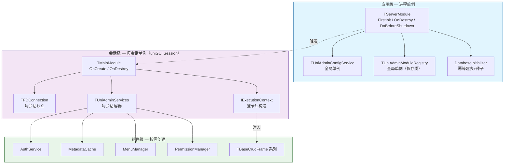
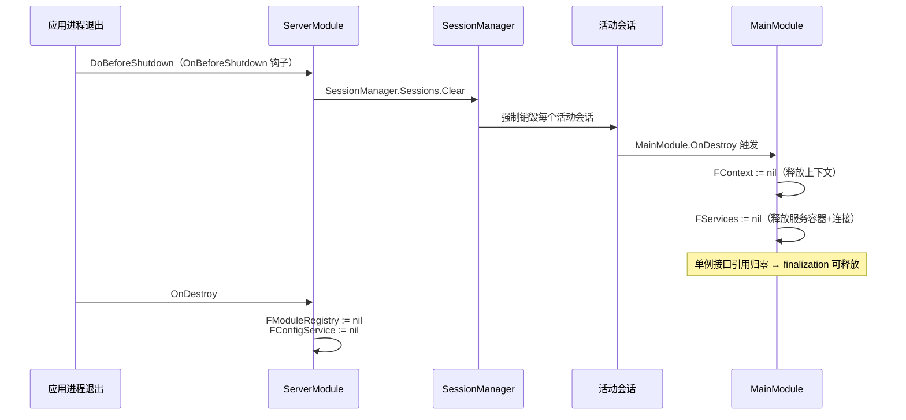
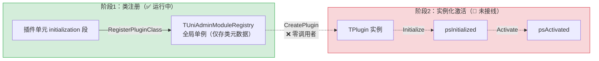
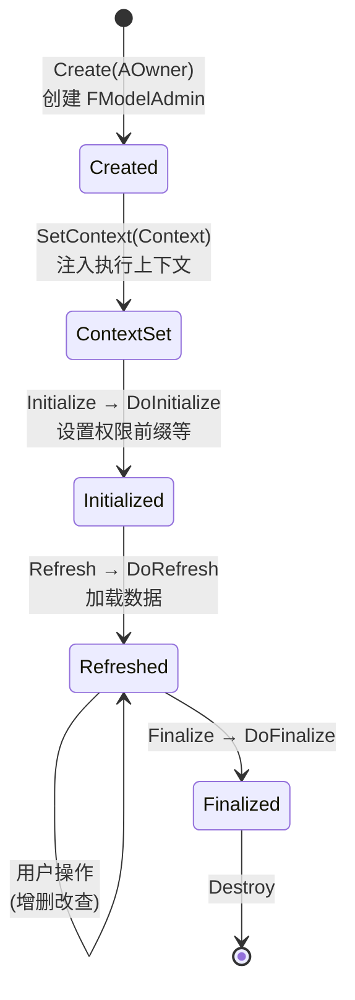
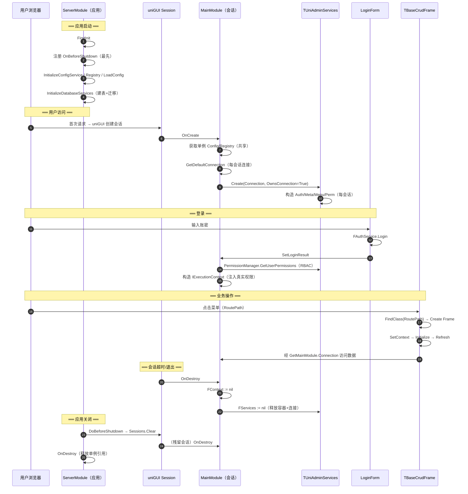

# UniAdmin 组件生命周期分析

> 分析日期：2026-06-27
> 分析方法：基于 CodeGraph 代码知识图谱的符号级调用链追踪 + verbatim 源码验证
> 分析范围：`src/Core/` 全部核心组件 + 关键 Modules/Plugins 样本
> 引用规范：`[文件:行号]`，所有论断均可回溯至源码

---

## 一、执行摘要

UniAdmin 的运行时由 **三层生命周期** 叠加构成：**应用级（ServerModule，进程单例）→ 会话级（MainModule，每会话单例）→ 组件级（Services / Plugin / UI Frame，按需创建）**。三层之间通过 **接口引用计数（Delphi `IInterface` ARC）** 与 **显式 `Owns` 所有权标志** 两条机制协同管理内存。

核心结论：

1. **应用级**：`TServerModule.FirstInit` 按严格顺序完成「注册退出钩子 → 切工作目录 → 配置服务 → 插件注册表 → 加载配置 → 数据库建表」，并在 `OnDestroy` / `DoBeforeShutdown` 中清理。
2. **会话级**：每个 uniGUI 会话创建独立的 `TMainModule`，持有**每会话独立的数据库连接**与 `TUniAdminServices` 服务容器；登录成功后由 `SetLoginResult` 构造含真实 RBAC 权限的执行上下文。
3. **两处关键的运行时缺陷**（已用调用链验证）：
   - 🚨 **任务调度器 `TUniAdminScheduler` 全代码完整但零调用者**——`Start` / `Create` 在全应用无任何驱动点，属于"已定义未接线"的死代码组件。
   - 🚨 **插件实例化路径 `CreatePlugin` → `Initialize` → `Activate` 零调用者**——插件注册（类注册）正常工作，但运行时从未实例化插件；当前 UI 实际由 `RegisterClass` + `FindClass` 的数据驱动 MDI 路由支撑。
4. **单例"双轨制"**：`TUniAdminMetadataCache` / `TUniAdminMenuManager` 同时存在全局 `GetInstance` 单例与每会话 `Create` 两条路径，服务容器刻意绕过单例走每会话，导致单例代码沦为"死代码"但实例方法仍可用。

---

## 二、三层生命周期模型总览



**核心机制**：
- 全局单例 = `class var FInstance` + `TCriticalSection` / `TMonitor` 双检锁（`UniAdminMetadataCache.pas:17-18`、`UniAdminModuleRegistry.pas:54-56`）
- 每会话对象 = uniGUI 会话销毁时触发 `MainModule.OnDestroy`，由 `TUniAdminServices.destructor` 逆序释放
- 接口对象 = Delphi ARC 引用计数自动释放（`IInterface`）

---

## 三、应用级生命周期（ServerModule）

### 3.1 启动流程：`FirstInit`

`TServerModule` 继承自 `TUniGUIServerModule`（`ServerModule.pas:20`），核心初始化在重写的 `FirstInit`（`ServerModule.pas:28`）中完成，顺序严格：

| 序号 | 步骤 | 代码位置 | 说明 |
|------|------|----------|------|
| 1️⃣ | 注册退出钩子 | `ServerModule.pas:88-91` | **第一位**执行 `OnBeforeShutdown := DoBeforeShutdown`，确保即使后续初始化中途抛异常也能清理 |
| 2️⃣ | 切换工作目录 | `ServerModule.pas:93-94` | cwd → exe 目录（bin/），保证 SQLite 库文件 / config 相对路径稳定 |
| 3️⃣ | `InitializeConfigService` | `ServerModule.pas:35` | 创建配置服务单例，设置 ConfigRoot，加载全局配置 |
| 4️⃣ | `InitializeModuleRegistry` | `ServerModule.pas:37` | 插件注册表单例初始化（类注册由各插件单元 initialization 段完成） |
| 5️⃣ | `LoadApplicationConfig` | `ServerModule.pas:39` | 加载 app.json 应用配置 |
| 6️⃣ | `InitializeDatabaseServices` | `ServerModule.pas:41,110` | **建表 + 迁移**（详见 3.3） |

> ⚠️ **方法注释与实现的偏差**：`InitializeDatabaseServices` 的 XML 注释写"初始化数据库连接与核心服务（Auth/Metadata/Menu/Permission）"（`ServerModule.pas:40`），但 CodeGraph 调用链显示其**实际只调用** `DatabaseInitializer.Initialize`（建表）、`DatabaseMigrator.Create/Migrate`（迁移）、`ReleaseConnection`（释放临时连接）——**并未创建那四个服务实例**。注释具有误导性，实际服务是每会话在 MainModule 中创建的。

### 3.2 退出流程：`OnDestroy` + `DoBeforeShutdown`

这是本项目**最关键的生命周期修复点**（对应 CLAUDE.md「运行时生命周期与内存陷阱」表 LRN-20260627-001）：



**为什么必须主动 `Sessions.Clear`**：uniGUI VCL 模式退出时，`TUniGUISessionManager.Destroy` 不会销毁活动会话（`Sessions.Clear` 不被调用，`TUniGUISessions.Destroy` 仅 Free 列表容器）。若不主动清理，所有活动会话的 MainModule / Services / Connection 全部泄漏（`ServerModule.pas:88-90` 注释、`ServerModule.pas:129-155` 实现）。

`DoBeforeShutdown` 实现要点（`ServerModule.pas:129-155`）：
- 防御性检查 `SessionManager = nil`（`ServerModule.pas:146-147`）
- `try-except` 包裹，清理失败仅记日志不中断退出（`ServerModule.pas:151-154`）

### 3.3 数据库初始化：幂等建表

`DatabaseInitializer.Initialize`（`DatabaseInitializer.pas:22`）以 `UniAdmin_Users` 表为标志判断是否首次初始化（`DatabaseInitializer.pas:435`），幂等执行 `CREATE TABLE IF NOT EXISTS`（`DatabaseInitializer.pas:12`）。SQLite 显式开启外键约束 `PRAGMA foreign_keys = ON`（`DatabaseInitializer.pas:432`）。

---

## 四、会话级生命周期（MainModule）

### 4.1 创建：`OnCreate`

`TMainModule` 继承自 `TUniGUIMainModule`（`MainModule.pas:22`），是"每会话单例，会话的心脏"（`MainModule.pas:15`）。`OnCreate`（`MainModule.pas:72-87`）做三件事：

1. **获取全局单例**（共享引用，不拥有）：
   - `FConfigService := TUniAdminConfigService.GetInstance`（`MainModule.pas:77`）
   - `FModuleRegistry := TUniAdminModuleRegistry.GetInstance`（`MainModule.pas:78`）
2. **创建每会话独立连接**：`FConnection := TUniAdminConnectionManager.GetInstance.GetDefaultConnection`（`MainModule.pas:81`）
3. **创建服务容器（拥有连接）**：`FServices := TUniAdminServices.Create(FConnection, True)`（`MainModule.pas:83`，`OwnsConnection=True`）

### 4.2 服务容器：`TUniAdminServices`

每会话实例（`UniAdminServices.pas:29`），是会话内所有核心服务的统一入口。构造时**直接 `Create`（而非 `GetInstance`）** 创建 4 个服务（`UniAdminServices.pas:74-79`）：

```pascal
// UniAdminServices.pas:74-79
// 初始化所有核心服务（使用构造函数直接创建，而非 GetInstance 单例）
FConnectionManager := TUniAdminConnectionManager.GetInstance;  // ← 唯一走单例
FAuthService       := TUniAdminAuthService.Create(FConnection);     // 每会话
FMetadataCache     := TUniAdminMetadataCache.Create(FConnection);   // 每会话
FMenuManager       := TUniAdminMenuManager.Create(FConnection);     // 每会话
FPermissionManager := TUniAdminPermissionManager.Create(FConnection);// 每会话
```

析构按**依赖逆序**释放（`UniAdminServices.pas:82-100`）：

| 顺序 | 字段 | 处理 |
|------|------|------|
| 1 | `FPermissionManager := nil` | 接口引用归零，ARC 释放 |
| 2 | `FMenuManager := nil` | 同上 |
| 3 | `FMetadataCache := nil` | 同上 |
| 4 | `FAuthService := nil` | 同上 |
| 5 | `FConnectionManager := nil` | 仅减引用（单例不释放） |
| 6 | `FConnection` | `OwnsConnection=True` 时关闭并 Free（`UniAdminServices.pas:91-96`） |

### 4.3 登录态与执行上下文：`SetLoginResult`

登录成功后由 `LoginForm.BtnLoginClick` 调用 `GetMainModule.SetLoginResult`（`LoginForm.pas:176`、`MainModule.pas:43`）。该方法构造**会话级执行上下文**（`MainModule.pas:115-159`）：

1. **重置旧上下文**：`FContext := nil`（ARC 释放，`MainModule.pas:125`）
2. **查询真实 RBAC 权限**：`FServices.PermissionManager.GetUserPermissions(UserID)`，走 `UserRoles → RolePermissions → Permissions` 三表（`MainModule.pas:131-139`）——替代旧版硬编码假权限
3. **构造上下文对象**：`TSessionInfo`（含 uniGUI SessionId + 真实 RemoteIP）→ `TUserContextImpl` → `TExecutionContextImpl`（`MainModule.pas:142-155`）

> 💡 **设计亮点**：登录态由 MainModule **按会话隔离持有**，注释明确指出"不再使用进程级 class var 传递，避免多用户并发覆盖"（`MainModule.pas:18-20`）。

### 4.4 销毁：`OnDestroy`

`OnDestroy`（`MainModule.pas:89-103`）严格逆序：

```
FContext := nil       → 释放执行上下文（ARC）
FServices := nil      → 释放服务容器（连带释放连接，OwnsConnection=True）
FConnection := nil    → 清空指针（已被 Services 释放）
FConfigService := nil → 仅减单例引用计数
FModuleRegistry := nil→ 仅减单例引用计数
```

> ⚠️ 此销毁**依赖 `DoBeforeShutdown` 主动触发**。若无 `Sessions.Clear`，`OnDestroy` 在应用退出时根本不会被调用（见 3.2）。

---

## 五、插件系统生命周期

### 5.1 双阶段模型：注册 vs 实例化

插件系统设计为两阶段，但**只有第一阶段实际运行**：



**证据**：
- ✅ `RegisterPluginClass` 有 **10 个调用者**（`UniModuleRegistration.pas`），各插件在单元 `initialization` 段注册类
- 🚨 `CreatePlugin`（`UniAdminModuleRegistry.pas:99`）**零调用者**——CodeGraph `codegraph_callers` 验证 `No callers found`

### 5.2 插件实例状态机（设计态，未运行）

`TPlugin`（`UniPlugin.pas:34`）设计的状态机（`UniPlugin.Intf.pas:11`）：

```
psUninitialized → psInitializing → psInitialized → psActivated → psDeactivated
                                                        ↓ (异常)
                                                     psError
```

测试用例 `TUniPluginTest`（`tests/Core/Plugin/UniPluginTest.pas`）验证了状态迁移，但这是**单元测试中的直接构造**，运行时主程序从未驱动此流程。

### 5.3 插件内的 DataModule 单例（设计态）

`TPlugin.GetDataModule` 设计为**插件级单例缓存**（`UniPlugin.pas:102`）：
- 首次调用创建并缓存到 `FDataModuleInstances: TDictionary<string, TDataModule>`（`UniPlugin.pas:42`）
- 插件销毁时统一 `Free` 所有缓存实例（`UniPlugin.pas:210-214`）
- 全程 `FLock: TCriticalSection` 线程安全（`UniPlugin.pas:43`）

> 由于插件实例化未接线，此机制当前**仅在单元测试中生效**。

---

## 六、UI 框架生命周期（TBaseCrudFrame）

### 6.1 CRUD Frame 生命周期方法

`TBaseCrudFrame`（`BaseCrudFrame.pas:17`，继承 `TUniFrame`）采用**模板方法模式**，子类通过 `override` 钩子扩展：



**子类必须遵循的资源管理契约**（以 `TLoginLogFrame` 为例，`LoginLogFrame.pas`）：
- 重写 `DoInitialize` 设置 `FPermissionPrefix`（`LoginLogFrame.pas:72-83`）
- 重写 `DoRefresh` 加载数据，**手动管理 `FLastDataSet`**（`LoginLogFrame.pas:85-116`）
- 重写 `Destroy` 调用 `FreeLastDataSet`（先断开 DataSource 再 Free，`LoginLogFrame.pas:57-70`）
- 单元 `initialization` 段 `RegisterClass(TLoginLogFrame)` 供路由使用（`LoginLogFrame.pas:140`）

> ⚠️ **内存陷阱**（CLAUDE.md LRN-20260626-003）：Frame destructor 中 `FQuery.Connection` 若裸引用 MainModule.Connection，销毁顺序会导致悬挂指针。规范做法是先 `FQuery.Connection := nil` 再 `FQuery.Free`。

### 6.2 数据驱动 MDI 路由（实际运行的 UI 机制）

当前 UI 的实际驱动机制是**数据驱动路由**，而非插件系统：

1. **编译时注册**：各 Frame 单元 `initialization` 段调用 `RegisterClass(TXxxFrame)`（如 `LoginLogFrame.pas:140`、`ConfigCategoryFrame.pas:214`）
2. **运行时路由**：菜单表 `UniAdmin_Menus.RoutePath` → `FindClass(RoutePath)` → 实例化对应 Frame

这与 CLAUDE.md「MDI 改造方案」记忆 `[[uniadmin-mdi-refactor-plan]]` 一致——启用 RoutePath 字段做 FindClass 数据驱动路由，替代硬编码 if-else。

---

## 七、任务调度器：已定义未接线（重大发现）

### 7.1 完整但沉睡的代码

`TUniAdminScheduler`（`UniAdminScheduler.pas:65`）的设计是完整的：

| 能力 | 实现 | 位置 |
|------|------|------|
| 状态管理 | `Start/Stop/Pause/Resume/IsRunning` | `UniAdminScheduler.pas:86-90` |
| 驱动方式 | `TUniTimer`（**非独立线程**，uniGUI 特有） | `UniAdminScheduler.pas:70` |
| 任务加载 | `LoadTasks`（从 DB 读取 `Status=1` 的任务） | `UniAdminScheduler.pas:74,138-149` |
| 定时回调 | `CheckAndExecuteTasks(Sender)` | `UniAdminScheduler.pas:77` |
| 任务执行 | `ExecuteTask` + `LogTaskExecution` | `UniAdminScheduler.pas:78-80` |
| 处理器工厂 | `TTaskProcessorFactory.CreateProcessor` | `UniTaskProcessor.pas:132` |
| 线程安全 | `FCriticalSection` 全程保护 | `UniAdminScheduler.pas:72` |

### 7.2 致命问题：零驱动点

CodeGraph 调用链验证：
- `Start`（`UniAdminScheduler.pas:86`）→ **`No callers found`**
- 全应用无 `TUniAdminScheduler.Create(...)` 调用
- `TServerModule` 字段仅有 `FConfigService/FModuleRegistry/FConfigRoot`（`ServerModule.pas:30-32`），**无 Scheduler 字段**
- `TMainModule` 字段仅有 `FConfigService/FModuleRegistry/FConnection/FServices/FContext`（`MainModule.pas:26-30`），**无 Scheduler 字段**

**结论**：`TUniAdminScheduler` 是一个**架构完整但完全未接入运行时的死代码组件**。任务管理 UI（`TaskManageFrame`/`TaskLogFrame`）可展示任务，但调度器从不运转，定时任务实际不会执行。

### 7.3 设计层面的矛盾

Scheduler 构造函数签名 `Create(Context, Connection)`（`UniAdminScheduler.pas:83`）存在根本矛盾：
- `Connection` 是**会话级**（每会话独立）
- `Context` 是**登录后才有的**（会话级）
- 但"调度器"本质应是**应用级**后台服务

这三者无法凑成一个合理的应用级调度器实例，解释了为何它难以被接线。

---

## 八、单例"双轨制"现象

### 8.1 MetadataCache 的双面性

`TUniAdminMetadataCache` 同时存在两条生命路径：

| 路径 | 代码 | 状态 |
|------|------|------|
| 全局单例 | `class function GetInstance(Connection)`（`UniAdminMetadataCache.pas:41`） | **未被运行时使用** |
| 每会话实例 | `TUniAdminMetadataCache.Create(FConnection)`（`UniAdminServices.pas:77`） | ✅ 实际运行路径 |

源码 TODO 注释自承认："当前实现为全局单例，不支持多连接场景。TODO: 未来版本考虑支持按连接管理的多实例模式"（`UniAdminMetadataCache.pas:38-40`）。

### 8.2 MenuManager 同理

`TUniAdminMenuManager` 同样有 `GetInstance(Connection)` 单例（`UniAdminMenuManager.pas:91,101-108`），但服务容器走每会话 `Create`（`UniAdminServices.pas:78`）。

### 8.3 唯一真正共享的单例

`TUniAdminConnectionManager` 是唯一**既被单例访问又被服务容器共享**的管理器（`UniAdminServices.pas:75`），但它只负责**创建**连接（`GetDefaultConnection` 转移所有权），连接本身由 `TUniAdminServices` 持有并释放。

> ⚠️ **启动连接泄漏陷阱**（CLAUDE.md LRN-20260627-003）：`GetDefaultConnection` 转移所有权（连接不在池），但 `ReleaseConnection` 假设在池，已修复为 `if FConnections.Remove(Connection) < 0 then Connection.Free`。

---

## 九、完整运行时生命周期时序



---

## 十、关键发现汇总

| # | 发现 | 严重度 | 证据 |
|---|------|--------|------|
| F1 | 任务调度器 `TUniAdminScheduler` 零接线，定时任务实际不执行 | 🔴 高 | `Start` 无调用者；SM/MM 无 Scheduler 字段 |
| F2 | 插件实例化路径 `CreatePlugin` 未接线，插件系统仅类注册生效 | 🔴 高 | `CreatePlugin` 无调用者；UI 走 RegisterClass/FindClass |
| F3 | `InitializeDatabaseServices` 注释与实现不符（未创建核心服务） | ✅ 已修复(2026-06-27) | 注释已改为"建表+迁移"；调用链确证不含核心服务创建 |
| F4 | 4 个管理器（Auth/Meta/Menu/Perm）单例"双轨制"，GetInstance 沦为死代码 | ✅ 已修复(2026-06-27) | 调用链验证 4 个 GetInstance 零调用者；已删单例代码，保留业务用 FLock |
| F5 | CLAUDE.md「服务层模式 `RegisterService<T>`」在代码中不存在 | ✅ 已修复(2026-06-27) | 根/Core CLAUDE.md 已改为构造注入描述 |
| F6 | 退出清理强依赖 `DoBeforeShutdown` 主动 Sessions.Clear | 🟢 已修复 | `ServerModule.pas:88-91,129-155` |
| F7 | Scheduler 构造签名（Context+Connection）与应用级语义矛盾 | 🟡 中 | `UniAdminScheduler.pas:83` |

---

## 十一、建议

### 🔴 高优先级

1. **接线或移除 Scheduler**：二选一——
   - 若需定时任务：在 `ServerModule.FirstInit` 末尾用**应用级专用连接**（非会话连接）+ 空上下文创建并 `Start` Scheduler，在 `OnDestroy` 中 `Stop` + Free。需重构构造签名以剥离对会话连接/登录上下文的依赖。
   - 若暂不需要：移除 `UniAdminScheduler` / `UniTaskProcessor` 及相关 UI，避免维护负担。

2. **接线插件实例化或明确弃用**：
   - 若继续插件化方向：在 `MainModule.SetLoginResult` 后（或首次访问菜单时）按 `GetLoadOrder` 拓扑排序调用 `CreatePlugin` + `Initialize` + `Activate`，会话结束时 `Deactivate`。
   - 若已转向数据驱动路由：在文档中明确标注插件实例化路径为"未启用"，避免后续开发者误用。

### 🟡 中优先级

3. ✅ **[已完成 2026-06-27] 修正 `InitializeDatabaseServices` 注释**：已改为"初始化数据库 Schema：建基础表 + 应用增量迁移脚本（不创建核心服务实例）"，并加 remarks 说明核心服务由每会话 TUniAdminServices 创建。

4. ✅ **[已完成 2026-06-27] 消除单例双轨制**：范围扩展至 4 个管理器（AuthService/MetadataCache/MenuManager/PermissionManager，调用链验证 GetInstance 全为零调用者）。采用方案 A（保留每会话）：
   - AuthService / MetadataCache：完全删除 FInstance + FLock + GetInstance + init/finalization（FLock 仅单例使用）
   - PermissionManager / MenuManager：仅删 FInstance + GetInstance，**保留 FLock**（业务方法的缓存线程安全依赖它）
   - 编译验证通过（3.78s，零 Error）

5. ✅ **[已完成 2026-06-27] 同步 CLAUDE.md 文档**：根 CLAUDE.md「服务层模式」+ Core CLAUDE.md FAQ「扩展权限系统」两处 `RegisterService<T>` 已替换为构造注入描述。

### 🟢 持续改进

6. **为关键生命周期补单测**：CodeGraph 标注 `DoBeforeShutdown`、`ExecuteTask`、`SetLoginResult`、`Connection`（Services）均 `⚠️ no covering tests found`。建议补充退出清理与登录上下文构造的测试。

---

## 十二、引用清单（核心证据源）

| 引用 | 文件 |
|------|------|
| ServerModule 生命周期 | `src/Core/Main/ServerModule.pas` |
| MainModule 生命周期 | `src/Core/Main/MainModule.pas` |
| 服务容器 | `src/Core/Services/UniAdminServices.pas` |
| 配置服务单例 | `src/Core/Config/UniAdminConfigService.pas` |
| 连接管理器 | `src/Core/Data/UniAdminConnectionManager.pas` |
| 数据库初始化 | `src/Core/Data/DatabaseInitializer.pas` |
| 元数据缓存（每会话，单例已清理） | `src/Core/Metadata/UniAdminMetadataCache.pas` |
| 菜单管理器（每会话，单例已清理） | `src/Core/Menu/UniAdminMenuManager.pas` |
| 插件基类与状态机 | `src/Core/Plugin/UniPlugin.pas`、`src/Core/Plugin/UniPlugin.Intf.pas` |
| 插件注册表 | `src/Core/Plugin/UniAdminModuleRegistry.pas`、`.Intf.pas` |
| 任务调度器（死代码） | `src/Core/Scheduler/UniAdminScheduler.pas`、`UniTaskProcessor.pas` |
| CRUD 框架 | `src/Core/UI/BaseCrudFrame.pas` |
| 登录流程 | `src/Core/UI/LoginForm.pas` |
| UI 样本（路由注册） | `src/Modules/Log/LoginLogFrame.pas`、`src/Modules/Config/ConfigCategoryFrame.pas` |
| 日志单例 | `src/Core/Logging/UniAdminLogger.pas` |

---

## 附录：分析方法论

- **工具**：CodeGraph MCP（`codegraph_explore` 符号源码 + `codegraph_callers` 调用链验证 + `codegraph_node` 单符号精确读取）
- **证据标准**：所有"零调用者""未接线"类断言均经 `codegraph_callers` 双重验证，非主观推断
- **局限**：
  - `UniAdminPluginLoader.pas` 的 blast radius 曾提示引用 `CreatePlugin`，但 `codegraph_callers` 确认无实际调用——可能为接口声明引用而非调用
  - 索引存在 ~1s 滞后，个别刚编辑文件可能未完全同步（不影响核心结论）
  - 未覆盖 `src/Frames/`、`tools/` 的完整生命周期（非框架核心）
