[根目录](../../CLAUDE.md) > **src** > **Core**

# Core 模块 - 核心框架层

> **职责**: 提供 UniAdmin 框架的核心基础设施和公共服务
> **状态**: ✅ 完成
> **覆盖率**: 90%

---

## 模块职责

Core 模块是 UniAdmin 框架的基础设施层，提供：

- **插件系统** - 动态加载、注册和管理业务插件
- **数据访问** - 统一的数据访问层和连接管理
- **认证授权** - 用户认证和权限管理
- **菜单管理** - 动态菜单生成和权限过滤
- **元数据管理** - 数据库表结构和字段元数据缓存
- **UI 框架** - CRUD 基类和配置驱动组件
- **服务定位** - 依赖注入和服务生命周期管理

### 子模块依赖关系

```mermaid
graph TB
    subgraph 启动层["启动层"]
        DPR["UniAdmin.dpr"]
        SM["Main/ServerModule"]
        MM["Main/MainModule"]
    end

    subgraph 核心服务["核心服务层"]
        Svc["Services/UniAdminServices<br/>服务定位器"]
        Cfg["Config/UniAdminConfigService"]
        Ctx["Context/UniContext"]
    end

    subgraph 数据层["数据层"]
        CM["Data/UniAdminConnectionManager"]
        DM["Data/UniAdminDataModule"]
        MC["Metadata/UniAdminMetadataCache"]
        FM["Metadata/UniFieldMetadata"]
    end

    subgraph 安全层["安全层"]
        Auth["Auth/UniAdminAuthService"]
        Perm["Permission/UniAdminPermissionManager"]
    end

    subgraph 扩展层["扩展层"]
        PI["Plugin/UniPlugin"]
        MR["Plugin/UniAdminModuleRegistry"]
        PL["Plugin/UniAdminPluginLoader"]
        Menu["Menu/UniAdminMenuManager"]
        SMS["Menu/SystemMenuSetup"]
    end

    subgraph UI层["UI 框架层"]
        BCF["UI/BaseCrudFrame"]
        MA["UI/UniAdminModel"]
        LF["UI/LoginForm"]
        MF["UI/MainFrame"]
        Tpl["UI/Templates/"]
        Sched["Scheduler/UniAdminScheduler"]
    end

    DPR --> SM
    DPR --> MM
    SM --> Svc
    MM --> Auth
    Svc --> Cfg
    Svc --> CM
    Auth --> Perm
    Auth --> Ctx
    MM --> Ctx
    MR --> PI
    PL --> MR
    BCF --> MA
    BCF --> MC
    MF --> Menu
    Menu --> SMS

    style 启动层 fill:#e1f5fe,stroke:#01579b
    style 核心服务 fill:#fff3e0,stroke:#e65100
    style 数据层 fill:#e8f5e9,stroke:#1b5e20
    style 安全层 fill:#fce4ec,stroke:#880e4f
    style 扩展层 fill:#f3e5f5,stroke:#4a148c
    style UI层 fill:#f1f8e9,stroke:#33691e
```



### 子模块导航

| 子模块 | 路径 | 关键文件 |
|--------|------|----------|
| Context 执行上下文 | `Core/Context/` | `UniContext.pas`（接口 + TSessionInfo/TUserContextImpl/TExecutionContextImpl 会话类型） |
| Plugin 插件系统 | `Core/Plugin/` | `UniPlugin.Intf.pas`, `UniAdminModuleRegistry.pas`, `UniAdminPluginLoader.pas` |
| Data 数据访问 | `Core/Data/` | `UniAdminConnectionManager.pas`, `UniAdminDataModule.pas` |
| Metadata 元数据 | `Core/Metadata/` | `UniAdminMetadataCache.pas`, `UniFieldMetadata.pas` |
| Auth 认证服务 | `Core/Auth/` | `UniAdminAuthService.Intf.pas`, `UniAdminAuthService.pas` |
| Menu 菜单管理 | `Core/Menu/` | `UniAdminMenuManager.pas`, `SystemMenuSetup.pas` |
| Permission 权限 | `Core/Permission/` | `UniAdminPermissionManager.pas` |
| Services 服务定位 | `Core/Services/` | `UniAdminServices.pas` |
| Scheduler 调度器 | `Core/Scheduler/` | `UniAdminScheduler.pas`, `UniTaskProcessor.pas` |
| Config 配置 | `Core/Config/` | `UniAdminConfigService.pas` |
| Main 主模块 | `Core/Main/` | `ServerModule.pas`, `MainModule.pas` |
| UI 框架 | `Core/UI/` | `BaseCrudFrame.pas`, `UniAdminModel.pas`, `MainFrame.pas`, `LoginForm.pas` |
| UI 模板 | `Core/UI/Templates/` | 9 个模板（Form, Dialog, Grid, Wizard 等） |

---

## 目录结构

```
Core/
├── Context/                # 执行上下文（含会话类型 TSessionInfo 等）
│   └── UniContext.pas     # 接口 IDatabaseConfig/IUserContext/IExecutionContext + 实现
├── Plugin/                 # 插件系统
│   ├── UniPlugin.Intf.pas          # 插件接口
│   ├── UniPlugin.Types.pas         # 插件类型定义
│   ├── UniPlugin.pas               # 插件基类
│   ├── UniAdminModuleRegistry.Intf.pas  # 模块注册接口
│   ├── UniAdminModuleRegistry.pas       # 模块注册实现
│   ├── UniModuleRegistration.pas   # 模块注册配置
│   └── UniAdminPluginLoader.pas         # 插件加载器
├── Data/                   # 数据访问
│   ├── UniAdminConnectionManager.Intf.pas  # 连接管理接口
│   ├── UniAdminConnectionManager.pas      # 连接管理实现
│   └── UniAdminDataModule.pas             # 数据模块基类
├── Metadata/               # 元数据管理
│   ├── UniAdminMetadataCache.Intf.pas     # 元数据缓存接口
│   ├── UniAdminMetadataCache.pas          # 元数据缓存实现
│   └── UniFieldMetadata.pas          # 字段元数据
├── Auth/                   # 认证服务
│   ├── UniAdminAuthService.Intf.pas        # 认证接口
│   └── UniAdminAuthService.pas            # 认证实现
├── Menu/                   # 菜单管理
│   ├── UniAdminMenuManager.Intf.pas        # 菜单接口
│   ├── UniAdminMenuManager.pas            # 菜单实现
│   └── SystemMenuSetup.pas           # 系统菜单配置
├── Permission/             # 权限管理
│   ├── UniAdminPermissionManager.Intf.pas  # 权限接口
│   └── UniAdminPermissionManager.pas      # 权限实现
├── Services/               # 核心服务
│   └── UniAdminServices.pas      # 服务定位器
├── Scheduler/              # 调度器
│   ├── UniAdminScheduler.pas     # 任务调度器
│   └── UniTaskProcessor.pas # 任务处理器
├── Config/                 # 配置服务
│   ├── UniAdminConfigService.Intf.pas  # 配置接口
│   └── UniAdminConfigService.pas      # 配置实现
├── Main/                   # 主模块
│   ├── ServerModule.pas    # UniGUI 服务器模块
│   └── MainModule.pas      # UniGUI 主模块
└── UI/                     # UI 组件
    ├── LoginForm.pas       # 登录窗体
    ├── MainFrame.pas       # 主窗体
    ├── BaseCrudFrame.pas   # CRUD 基类
    ├── UniAdminModel.pas   # 模型管理组件
    ├── UniAdminPropertyEditor.pas # 属性编辑器
    ├── UniAdminLayout.pas       # 布局组件
    ├── UniAdminTheme.pas        # 主题组件
    └── Templates/          # UI 模板
        ├── BaseFormTemplate.pas
        ├── DialogTemplate.pas
        ├── EditFormTemplate.pas
        ├── GridTemplate.pas
        ├── QueryPanelTemplate.pas
        ├── SplitterTemplate.pas
        ├── StatusBarTemplate.pas
        ├── TabSheetTemplate.pas
        └── WizardTemplate.pas
```

---

## 入口与启动

### 主程序入口

**文件**: `UniAdmin.dpr`

```pascal
program UniAdmin;

begin
  Application.Initialize;
  Application.ServerModuleClass := TServerModule;
  Application.MainModuleClass := TMainModule;
  Application.LoginFormClass := TLoginForm;
  Application.MainFormClass := TMainFrame;
  Application.Run;
end;
```

### 启动流程

```
UniAdmin.dpr
    ↓
ServerModule (服务器初始化)
    ↓
MainModule (主模块初始化)
    ↓
LoginForm (用户登录)
    ↓
MainFrame (主界面加载)
    ↓
插件加载 (UniAdminModuleRegistry)
    ↓
菜单生成 (UniAdminMenuManager)
```

---

## 对外接口

### 插件系统接口

**IPlugin** (`UniPlugin.Intf.pas`)

```pascal
IPlugin = interface(IInterface)
  ['{GUID}']
  procedure Initialize;
  procedure Activate;
  procedure Deactivate;
  function GetInfo: TPluginInfo;
end;
```

### 认证服务接口

**IUniAdminAuthService** (`UniAdminAuthService.Intf.pas`)

```pascal
IUniAdminAuthService = interface(IInterface)
  ['{GUID}']
  function Login(const UserName, Password: string): Boolean;
  procedure Logout;
  function GetCurrentUserID: Integer;
  function GetCurrentUser: TUserInfo;
end;
```

### 菜单管理接口

**IUniAdminMenuManager** (`UniAdminMenuManager.Intf.pas`)

```pascal
IUniAdminMenuManager = interface(IInterface)
  ['{GUID}']
  function GetMenuTree(const UserID: Integer): TMenuNodeArray;
  procedure AddMenuItem(const Item: TMenuItem);
  procedure UpdateMenuItem(const Item: TMenuItem);
  procedure DeleteMenuItem(const MenuID: Integer);
end;
```

### 权限管理接口

**IUniAdminPermissionManager** (`UniAdminPermissionManager.Intf.pas`)

```pascal
IUniAdminPermissionManager = interface(IInterface)
  ['{GUID}']
  function CheckPermission(const UserID: Integer; const Permission: string): Boolean;
  function GetUserPermissions(const UserID: Integer): TPermissionArray;
  procedure AssignRolePermissions(const RoleID: Integer; const Permissions: array of string);
end;
```

---

## 关键依赖与配置

### 依赖项

| 依赖 | 版本 | 用途 |
|------|------|------|
| UniGUI | 1.6+ | Web 应用框架 |
| FireDAC | - | 数据访问组件 |
| Delphi 12 | Athens | 开发环境 |

### 配置文件

**app.json** (`config/app.json`)

```json
{
  "version": "1.0.0",
  "application": {
    "name": "UniAdmin 管理系统",
    "title": "UniAdmin"
  },
  "server": {
    "port": 8077,
    "host": "0.0.0.0",
    "sessionTimeout": 1800
  },
  "database": {
    "type": "MSSQL",
    "connectionString": "Server=localhost;Database=UniAdmin;..."
  }
}
```

---

## 数据模型

### 核心数据表

| 表名 | 说明 | 关键字段 |
|------|------|----------|
| `UniAdmin_Users` | 用户表 | UserID, UserName, Password, Status |
| `UniAdmin_Roles` | 角色表 | RoleID, RoleCode, RoleName, DataScope |
| `UniAdmin_Permissions` | 权限表 | PermissionID, PermissionCode, ResourceType |
| `UniAdmin_UserRoles` | 用户角色关联 | UserID, RoleID |
| `UniAdmin_RolePermissions` | 角色权限关联 | RoleID, PermissionID |
| `UniAdmin_Menus` | 菜单表 | MenuID, MenuName, ParentID, MenuType |
| `UniAdmin_Modules` | 模块注册表 | ModuleID, ModuleCode, AssemblyName |
| `UniAdmin_Configs` | 系统配置 | ConfigID, ConfigKey, ConfigValue |

---

## 测试与质量

### 单元测试

**测试文件**: `tests/Core/Plugin/UniPluginTest.pas`

```pascal
TUniPluginTest = class(TTestCase)
published
  procedure TestPluginRegistration;
  procedure TestPluginActivation;
  procedure TestPluginDependencies;
end;
```

### 运行测试

```bash
cd tests
UniAdminTests.exe
```

---

## 常见问题 (FAQ)

### Q: 如何创建新的插件?

A: 参考 `DictionaryPlugin.pas` 实现示例：

1. 实现 `IPlugin` 接口
2. 在 `UniModuleRegistration.pas` 中注册
3. 编译为 BPL 包或直接链接到主程序

### Q: 如何扩展权限系统?

A: 实现 `IUniAdminPermissionManager` 接口，在 `TUniAdminServices` 构造时替换为自定义实现（构造注入，非注册表）：

```pascal
// UniAdminServices.pas 构造函数中替换默认实现
FPermissionManager := TCustomPermissionManager.Create(FConnection);
```

### Q: 数据库连接失败怎么办?

A: 检查 `config/app.json` 中的连接字符串，确保：
- SQL Server 服务已启动
- 用户名密码正确
- 防火墙允许连接

---

## 相关文件清单

### 核心接口文件

- `UniPlugin.Intf.pas` - 插件接口
- `UniPlugin.Types.pas` - 插件类型定义
- `UniAdminModuleRegistry.Intf.pas` - 模块注册接口
- `UniAdminAuthService.Intf.pas` - 认证接口
- `UniAdminMenuManager.Intf.pas` - 菜单接口
- `UniAdminPermissionManager.Intf.pas` - 权限接口
- `UniAdminMetadataCache.Intf.pas` - 元数据接口
- `UniAdminConfigService.Intf.pas` - 配置接口

### 核心实现文件

- `UniPlugin.pas` - 插件基类
- `UniAdminModuleRegistry.pas` - 模块注册
- `UniAdminAuthService.pas` - 认证实现
- `UniAdminMenuManager.pas` - 菜单实现
- `UniAdminPermissionManager.pas` - 权限实现
- `UniAdminMetadataCache.pas` - 元数据缓存
- `UniAdminConfigService.pas` - 配置实现

### UI 框架文件

- `BaseCrudFrame.pas` - CRUD 基类
- `UniAdminModel.pas` - 模型管理组件
- `LoginForm.pas` - 登录窗体
- `MainFrame.pas` - 主窗体

---

## 变更记录 (Changelog)

| 日期 | 操作 | 说明 |
|------|------|------|
| 2026-06-24 | 更新 | 添加 Mermaid 依赖图和子模块导航表 |
| 2026-03-02 | 初始化 | 创建 Core 模块文档 |

---

*模块版本: 1.1*
*最后更新: 2026-06-24*
