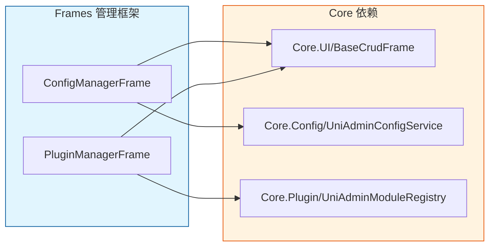

[根目录](../../CLAUDE.md) > **src** > **Frames**

# Frames 模块 — 管理框架界面

> **职责**: 提供系统级管理界面（配置管理器、插件管理器）
> **状态**: ✅ 完成

---

## 目录结构

```
Frames/
├── ConfigManagerFrame.pas     # 配置管理器界面
├── ConfigManagerFrame.dfm     # 配置管理器窗体设计
├── PluginManagerFrame.pas     # 插件管理器界面
└── PluginManagerFrame.dfm     # 插件管理器窗体设计
```

---

## 模块说明

### ConfigManagerFrame

系统配置管理界面，提供：
- 配置项的增删改查
- 配置分类管理
- 配置值编辑（支持多种数据类型）

### PluginManagerFrame

插件管理界面，提供：
- 已安装插件列表
- 插件启用/禁用切换
- 插件依赖关系查看
- 插件加载状态监控

---

## 与其他模块的关系



---

## 注册方式

在 `UniAdmin.dpr` 中注册：

```pascal
uses
  ConfigManagerFrame in 'Frames\ConfigManagerFrame.pas',
  PluginManagerFrame in 'Frames\PluginManagerFrame.pas',
```

---

*模块版本: 1.0*
*最后更新: 2026-06-24*
