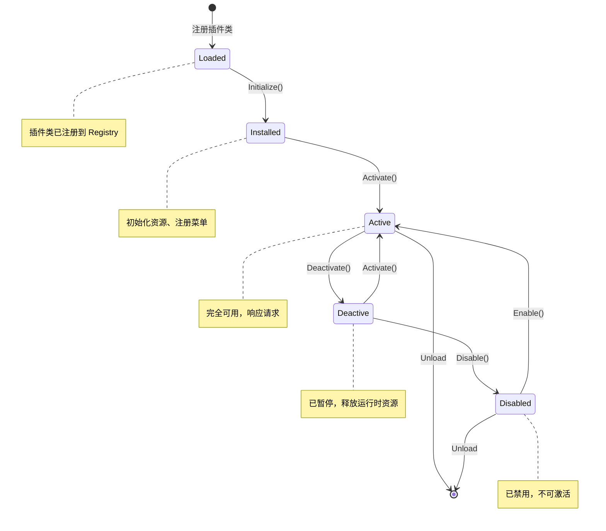

[根目录](../../CLAUDE.md) > **src** > **Plugins**

# Plugins 模块 - 插件扩展层

> **职责**: 提供可插拔的业务功能扩展
> **状态**: ✅ 完成
> **覆盖率**: 80%

---

## 模块职责

Plugins 模块展示 UniAdmin 框架的插件机制，提供：

- **插件示例** - 演示如何创建和注册插件
- **动态扩展** - 运行时加载和卸载功能模块
- **独立打包** - 插件可独立编译和分发
- **依赖管理** - 自动解析插件依赖关系

### 插件生命周期



### 子模块导航

| 子模块 | 路径 | 说明 |
|--------|------|------|
| Dictionary 字典插件 | `Plugins/Dictionary/` | 完整的插件开发示例，包含 Plugin、ListFrame、DataModule |
| DictionaryPlugin.pas | `Plugins/Dictionary/DictionaryPlugin.pas` | 插件主类实现 |
| DictionaryListFrame.pas | `Plugins/Dictionary/DictionaryListFrame.pas` | 插件 UI 界面 |
| DictionaryDataModule.pas | `Plugins/Dictionary/DictionaryDataModule.pas` | 插件数据访问 |
| plugin.json | `Plugins/Dictionary/plugin.json` | 插件元数据配置 |

---

## 目录结构

```
Plugins/
└── Dictionary/             # 数据字典插件示例
    ├── DictionaryPlugin.pas      # 插件实现
    ├── DictionaryListFrame.pas   # 插件 UI
    └── DictionaryDataModule.pas  # 插件数据访问
```

---

## 入口与启动

### 插件注册

插件在 `UniModuleRegistration.pas` 中注册：

```pascal
procedure RegisterPlugins;
begin
  // 注册数据字典插件
  TUniModuleRegistry.GetInstance.RegisterPluginClass(
    TDictionaryPlugin,
    'dictionary-plugin',
    LPluginInfo
  );
end;
```

### 插件激活

```pascal
// 插件在系统启动时自动加载
// 或通过运行时插件管理器手动加载
```

---

## 对外接口

### 插件接口

所有插件必须实现 `IPlugin` 接口：

```pascal
IPlugin = interface(IInterface)
  ['{GUID}']
  procedure Initialize;
  procedure Activate;
  procedure Deactivate;
  function GetInfo: TPluginInfo;
end;
```

### 插件信息结构

```pascal
TPluginInfo = record
  Name: string;              // 插件名称
  DisplayName: string;       // 显示名称
  Version: string;           // 版本号
  Description: string;       // 描述
  Author: string;            // 作者
  Dependencies: TArray<string>; // 依赖的其他插件
end;
```

---

## 关键依赖与配置

### 依赖项

| 依赖 | 模块 | 用途 |
|------|------|------|
| Core.Plugin | UniPlugin | 插件基类和接口 |
| Core.Metadata | UniMetadataCache | 元数据访问 |
| Core.UI | BaseCrudFrame | UI 基类 |

### 插件配置

插件可通过配置文件定义元数据：

```json
{
  "name": "dictionary-plugin",
  "version": "1.0.0",
  "displayName": "数据字典插件",
  "description": "提供数据字典管理功能",
  "author": "UniAdmin Team",
  "dependencies": []
}
```

---

## 数据模型

### 插件注册表

插件信息存储在 `UniAdmin_Modules` 表：

| 字段 | 类型 | 说明 |
|------|------|------|
| ModuleID | UNIQUEIDENTIFIER | 主键 |
| ModuleCode | NVARCHAR(50) | 模块代码 |
| ModuleName | NVARCHAR(100) | 模块名称 |
| ModuleType | NVARCHAR(20) | 模块类型 |
| Version | NVARCHAR(20) | 版本号 |
| AssemblyName | NVARCHAR(255) | 程序集名称 |
| EntryPointType | NVARCHAR(255) | 入口类型 |
| IsActive | BIT | 是否启用 |
| IsSystem | BIT | 是否系统模块 |
| LoadOrder | INT | 加载顺序 |

---

## 测试与质量

### 测试状态

| 插件 | 测试状态 | 说明 |
|------|----------|------|
| Dictionary | ⚠️ 待补充 | 需要插件加载测试 |

### 推荐测试用例

```pascal
TDictionaryPluginTest = class(TTestCase)
published
  procedure TestPluginRegistration;
  procedure TestPluginActivation;
  procedure TestPluginDataAccess;
  procedure TestPluginUI;
end;
```

---

## 常见问题 (FAQ)

### Q: 如何创建新插件?

A: 按以下步骤创建：

1. 创建插件目录，如 `Plugins/MyPlugin/`
2. 实现插件类，继承 `TPlugin`
3. 实现 `IPlugin` 接口方法
4. 在 `UniModuleRegistration.pas` 中注册
5. 编译并测试

```pascal
type
  TMyPlugin = class(TPlugin, IPlugin)
  protected
    procedure DoInitialize; override;
    procedure DoActivate; override;
    procedure DoDeactivate; override;
  end;

procedure TMyPlugin.DoInitialize;
begin
  // 插件初始化逻辑
end;
```

### Q: 如何管理插件依赖?

A: 在插件信息的 `Dependencies` 数组中声明：

```pascal
LPluginInfo.Dependencies := TArray<string>.Create(
  'core-plugin',
  'auth-plugin'
);
```

框架会按依赖顺序自动加载插件。

### Q: 插件可以独立分发吗?

A: 可以。插件可以：

1. 编译为 BPL 包
2. 作为 DLL 动态加载
3. 直接链接到主程序

推荐方式是编译为 BPL 包，实现真正的动态加载。

---

## 相关文件清单

### 数据字典插件

- `Dictionary/DictionaryPlugin.pas` - 插件实现
- `Dictionary/DictionaryListFrame.pas` - 插件 UI
- `Dictionary/DictionaryDataModule.pas` - 插件数据访问

---

## 插件开发指南

### 插件生命周期

```
Loaded → Installed → Active → Deactive → Disabled
  ↑                               ↓
  └───────────────────────────────┘
```

### 插件类型

| 类型 | 说明 | 示例 |
|------|------|------|
| **控件插件** | 自定义输入控件 | 富文本编辑器、代码编辑器 |
| **操作插件** | 自定义操作按钮 | 批量邮件、生成报表 |
| **验证插件** | 自定义验证规则 | 身份证验证、手机号验证 |
| **导出插件** | 导出格式扩展 | Excel、PDF、CSV |
| **图表插件** | 数据可视化 | 趋势图、饼图、柱状图 |

### 插件最佳实践

1. **单一职责** - 每个插件只做一件事
2. **接口隔离** - 定义清晰的接口
3. **依赖声明** - 明确声明依赖关系
4. **错误处理** - 插件不应导致主程序崩溃
5. **资源释放** - 正确实现 Deactivate 释放资源

---

## 变更记录 (Changelog)

| 日期 | 操作 | 说明 |
|------|------|------|
| 2026-06-24 | 更新 | 添加 Mermaid 生命周期图和子模块导航 |
| 2026-03-02 | 初始化 | 创建 Plugins 模块文档 |

---

*模块版本: 1.1*
*最后更新: 2026-06-24*
