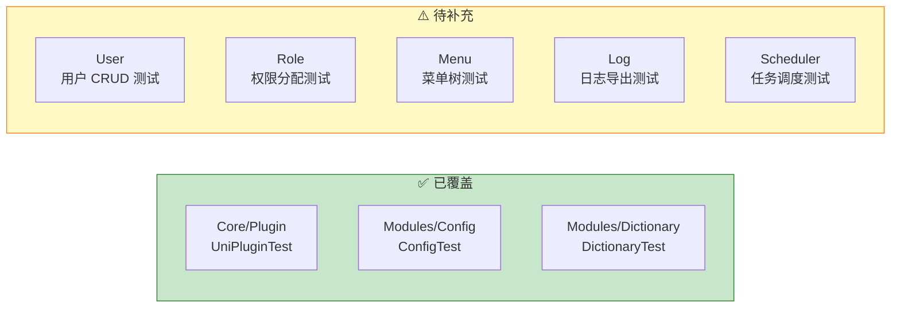

[根目录](../CLAUDE.md) > **tests**

# Tests 模块 — 单元测试

> **职责**: UniAdmin 框架的 DUnitX 单元测试
> **状态**: ✅ 基础完成
> **覆盖率**: 插件系统、配置服务、字典服务

---

## 目录结构

```
tests/
├── UniAdminTests.dpr          # 测试项目入口
├── UniAdminTests.dproj        # 测试项目文件
├── Core/
│   └── Plugin/
│       └── UniPluginTest.pas  # 插件系统测试
├── Modules/
│   ├── ConfigTest.pas         # 配置服务测试
│   ├── DictionaryTest.pas     # 字典服务测试
│   ├── LogTest.pas            # 日志服务测试
│   ├── MenuTest.pas           # 菜单服务测试
│   ├── RoleTest.pas           # 角色服务测试
│   └── SchedulerTest.pas      # 任务调度测试
├── Performance/               # 性能测试
├── Phase2/                    # 第二阶段测试
├── Phase3/                    # 第三阶段测试
├── Win32/                     # 编译输出
├── .coverage.yml              # 覆盖率配置
├── DUnitX-运行指南.md          # 测试运行指南
├── Test-运行指南.md             # 测试运行指南（中文）
├── Phase1-TestReport.md       # 第一阶段测试报告
├── TestValidationReport.md    # 测试验证报告
└── 测试执行总结.md               # 测试执行总结
```

---

## 运行测试

```bash
# 方式 1: 直接运行
cd tests && UniAdminTests.exe

# 方式 2: 在 Delphi IDE 中打开 UniAdminTests.dpr，按 F9
```

测试结果输出为控制台日志 + NUnit XML 格式 (`TestResults.xml`)。

---

## 测试覆盖



---

## 测试结构

```pascal
// 典型 DUnitX 测试单元
TUniPluginTest = class(TTestCase)
published
  procedure TestPluginRegistration;
  procedure TestPluginActivation;
  procedure TestPluginDependencies;
end;
```

### 添加新测试

1. 在 `tests/Modules/` 或 `tests/Core/` 创建测试单元
2. 在 `UniAdminTests.dpr` 的 `uses` 部分注册
3. 使用 `[Test]` 属性或 `published` 方法定义测试用例

---

## 相关文件

- `UniAdminTests.dpr` — 测试项目入口
- `Core/Plugin/UniPluginTest.pas` — 插件系统测试
- `DUnitX-运行指南.md` — 运行指南

---

*模块版本: 1.0*
*最后更新: 2026-06-24*
