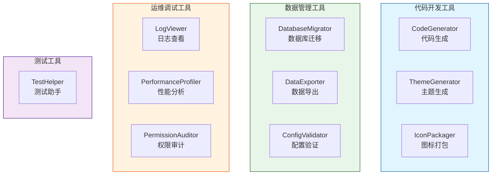

[根目录](../CLAUDE.md) > **tools**

# Tools 模块 — 开发辅助工具

> **职责**: 提供 UniAdmin 开发过程中的辅助工具集
> **状态**: ✅ 完成
> **工具数量**: 10 个

---

## 工具清单

| 工具 | 文件 | 功能 |
|------|------|------|
| 代码生成器 | `CodeGenerator.pas` | 根据数据库表结构自动生成 CRUD 代码（Frame、Form、DataModule） |
| 配置验证器 | `ConfigValidator.pas` | 验证 ProjectConfig.json 和 app.json 配置文件合法性 |
| 数据库迁移器 | `DatabaseMigrator.pas` | 数据库 Schema 版本管理和迁移脚本执行 |
| 数据导出器 | `DataExporter.pas` | 数据导出为 CSV、Excel、JSON、XML 格式 |
| 图标打包器 | `IconPackager.pas` | 批量处理和打包图标资源 |
| 日志查看器 | `LogViewer.pas` | 查看和过滤运行时日志 |
| 性能分析器 | `PerformanceProfiler.pas` | 方法级性能分析和耗时统计 |
| 权限审计器 | `PermissionAuditor.pas` | 审计用户权限和数据范围配置 |
| 测试助手 | `TestHelper.pas` | 单元测试辅助工具（模拟数据、断言扩展） |
| 主题生成器 | `ThemeGenerator.pas` | 生成和自定义 UI 主题 |

---

## 使用方式

这些工具是 Delphi 单元（.pas），通常以以下方式使用：

```pascal
// 代码生成器示例
uses CodeGenerator;
var Gen := TCodeGenerator.Create;
try
  Gen.TableName := 'MyTable';
  Gen.GenerateAll;  // 生成 Frame + Form + DataModule
finally
  Gen.Free;
end;

// 数据导出器示例
uses DataExporter;
var Exp := TDataExporter.Create;
try
  Exp.ExportToExcel(Query, 'output.xlsx');
finally
  Exp.Free;
end;
```

---

## 工具分类



---

*模块版本: 1.0*
*最后更新: 2026-06-24*
